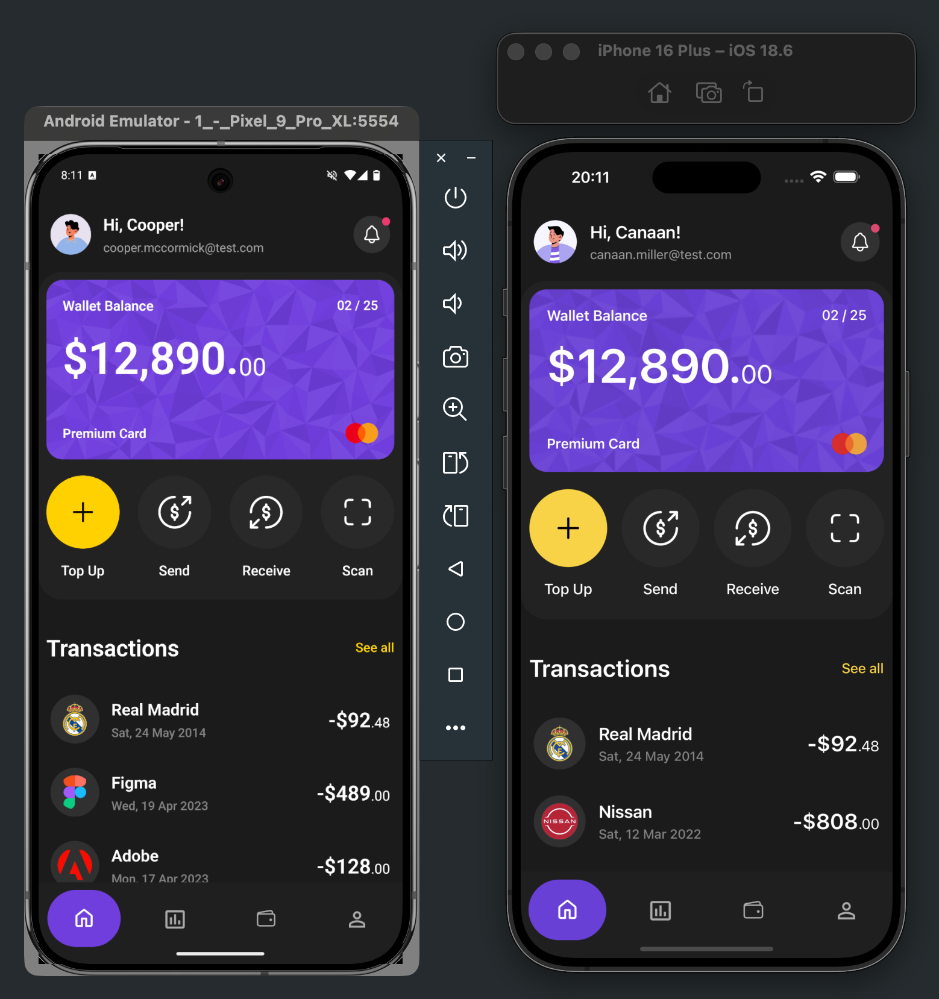
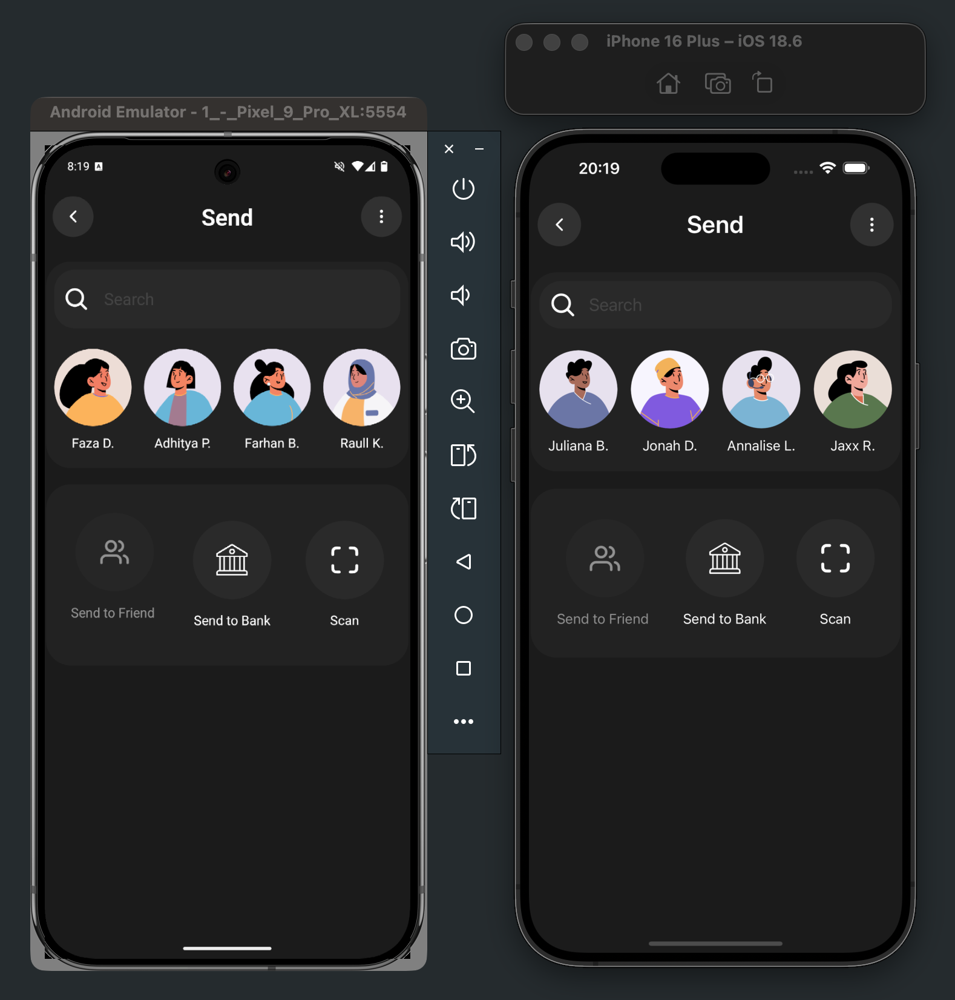
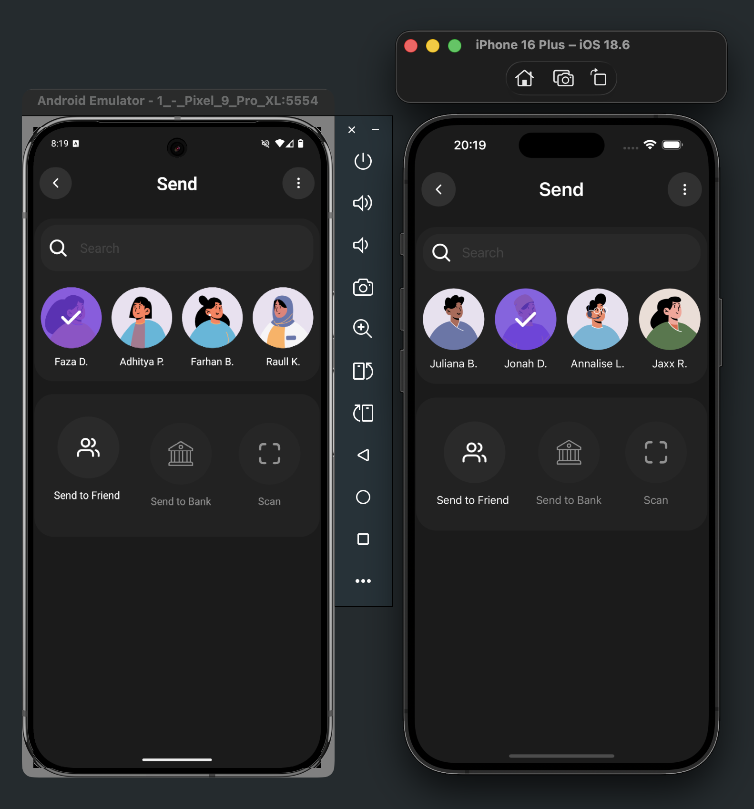
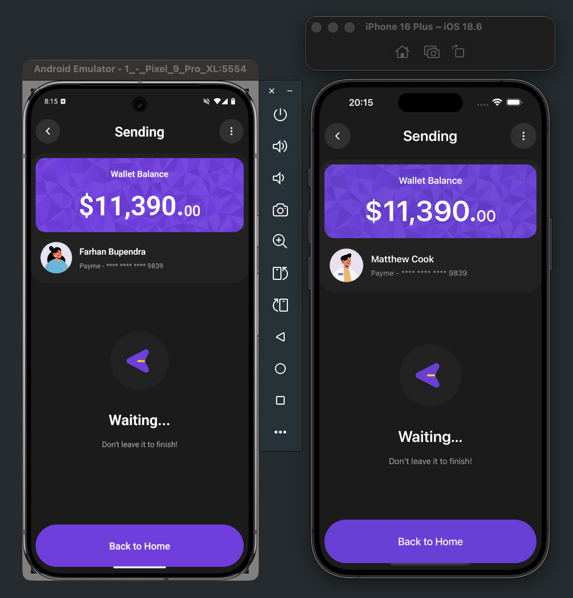
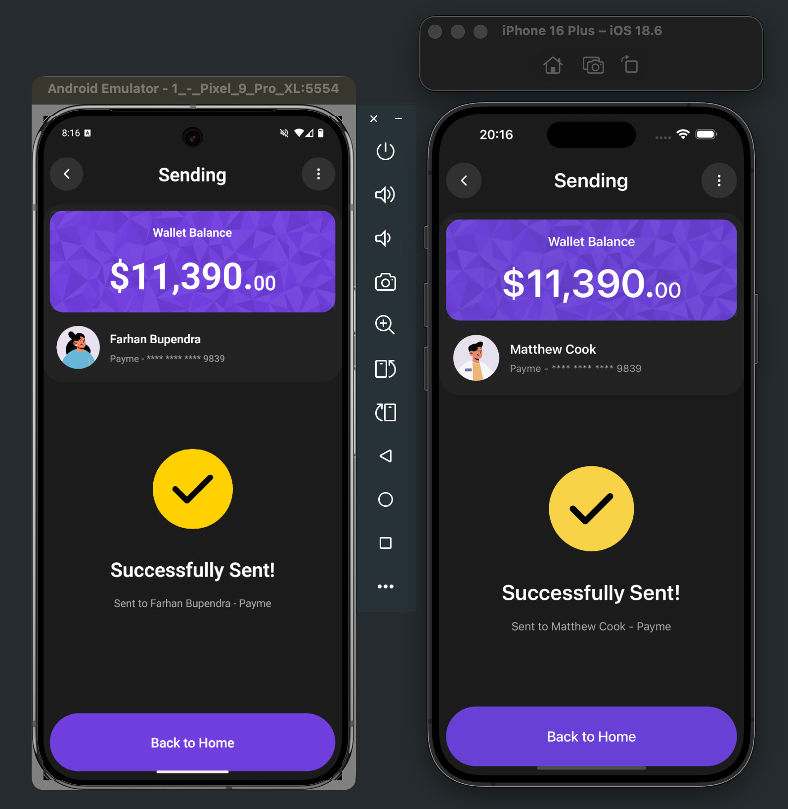
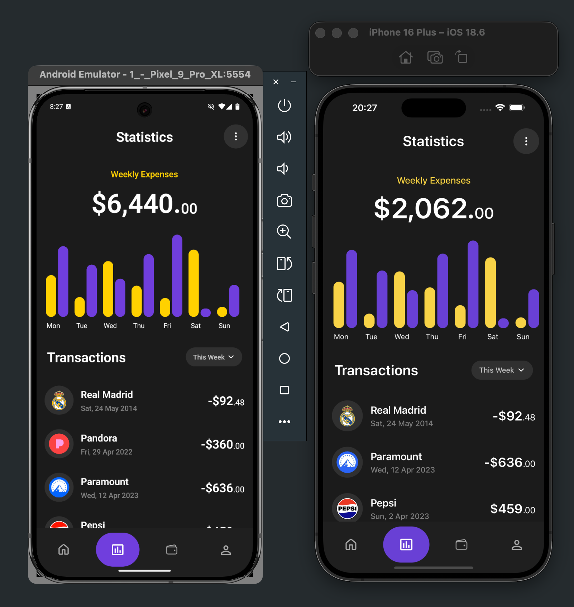
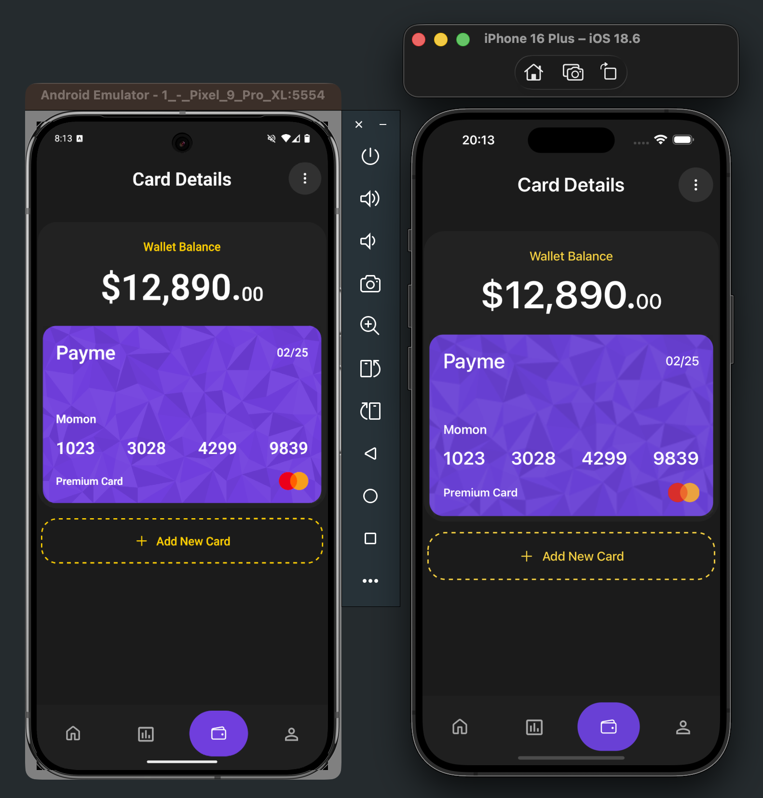
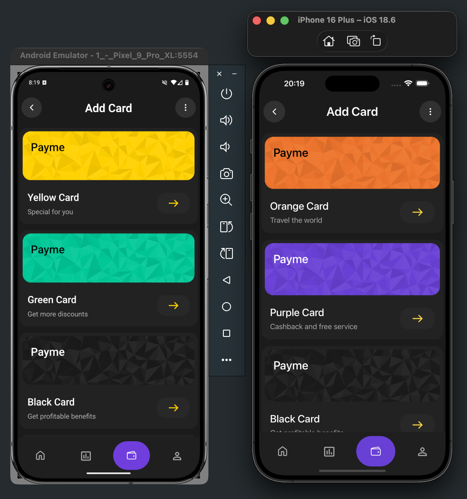
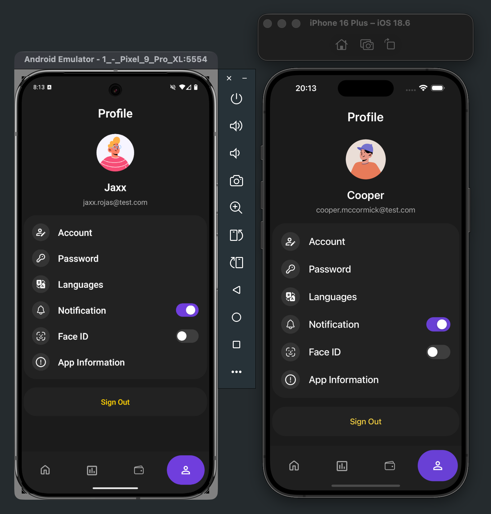

# Payme 👋

This is a React Native app designed based on [PayMe UI](https://dribbble.com/shots/20774179-Payme-Finance-Mobile-App-Detail-Screen) on [Dribbble](https://dribbble.com)

## Disclaimer

This project is a personal hobby project developed primarily for learning and experimentation. It is not intended for production use.

Please note the following:

- **Educational Purpose:** The code and techniques used here are for educational exploration and may not follow best practices for enterprise-level software.

- **UI Case Study:** The user interface design and its elements were selected specifically as a case study for this project. They are not related to, or based on, any freelance projects or professional client work I have completed. Any resemblance to other UIs is coincidental.

## Get started

1. Install dependencies

   ```bash
   npm install
   ```

2. Start the app

   ```bash
   npx expo start
   ```

In the output, you'll find options to open the app in a

- [development build](https://docs.expo.dev/develop/development-builds/introduction/)
- [Android emulator](https://docs.expo.dev/workflow/android-studio-emulator/)
- [iOS simulator](https://docs.expo.dev/workflow/ios-simulator/)
- [Expo Go](https://expo.dev/go), a limited sandbox for trying out app development with Expo

## [UI](https://dribbble.com/shots/20774179-Payme-Finance-Mobile-App-Detail-Screen)


## Screenshots

### [Home Screen](https://dribbble.com/shots/20774179-Payme-Finance-Mobile-App-Detail-Screene)



### [Select Contact Screen](https://dribbble.com/shots/20774179-Payme-Finance-Mobile-App-Detail-Screene)



### [Contact Selected Screen](https://dribbble.com/shots/20774179-Payme-Finance-Mobile-App-Detail-Screene)



### [Money Sending Screen](https://dribbble.com/shots/20774179-Payme-Finance-Mobile-App-Detail-Screene)



### [Money Sent Screen](https://dribbble.com/shots/20774179-Payme-Finance-Mobile-App-Detail-Screene)



### [Statistics Screen](https://dribbble.com/shots/20774179-Payme-Finance-Mobile-App-Detail-Screene)



### [Card Details Screen](https://dribbble.com/shots/20774179-Payme-Finance-Mobile-App-Detail-Screene)



### [Add Card Screen](https://dribbble.com/shots/20774179-Payme-Finance-Mobile-App-Detail-Screene)



### [Profile Screen](https://dribbble.com/shots/20774179-Payme-Finance-Mobile-App-Detail-Screene)



## Flaticons Attribution

- [Bank icons created by Those Icons - Flaticon](https://www.flaticon.com/free-icons/bank)


- [Face id icons created by OwlDsgnr - Flaticon](https://www.flaticon.com/free-icons/face-id)


- [Paper plane icons created by J703 - Flaticon](https://www.flaticon.com/free-icons/paper-plane)


- [Send money icons created by Anggara - Flaticon](https://www.flaticon.com/free-icons/send-money)


- [Translation icons created by Freepik - Flaticon](https://www.flaticon.com/free-icons/translation)


