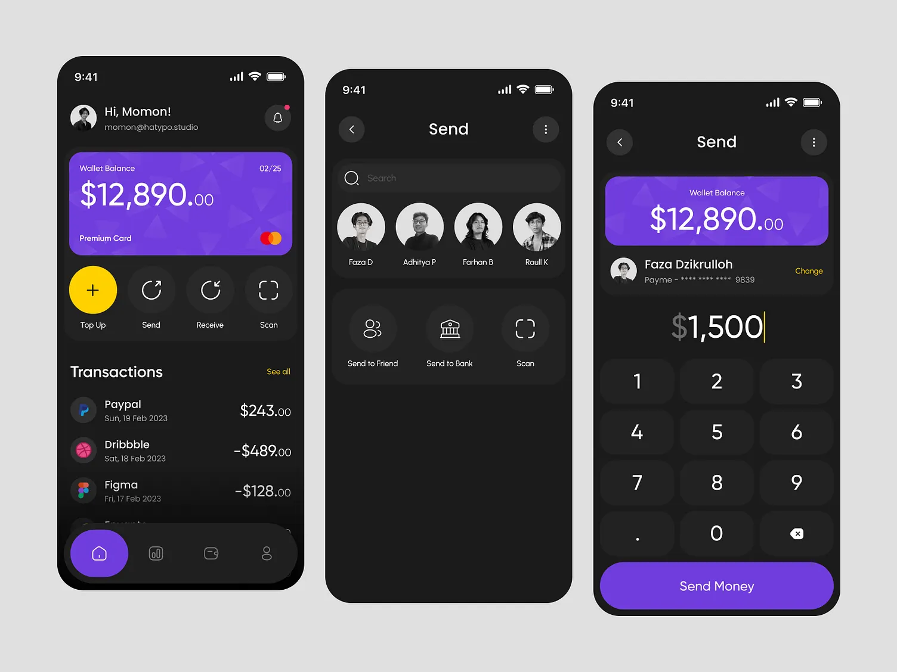
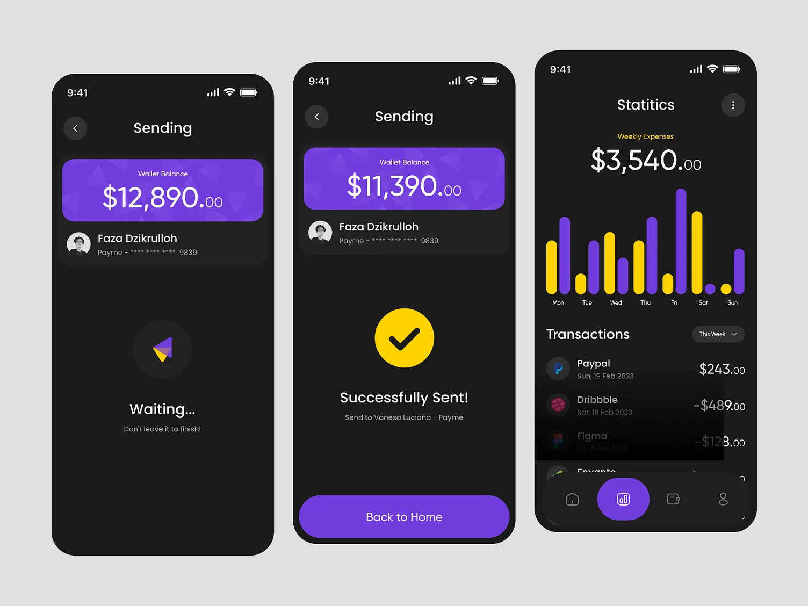
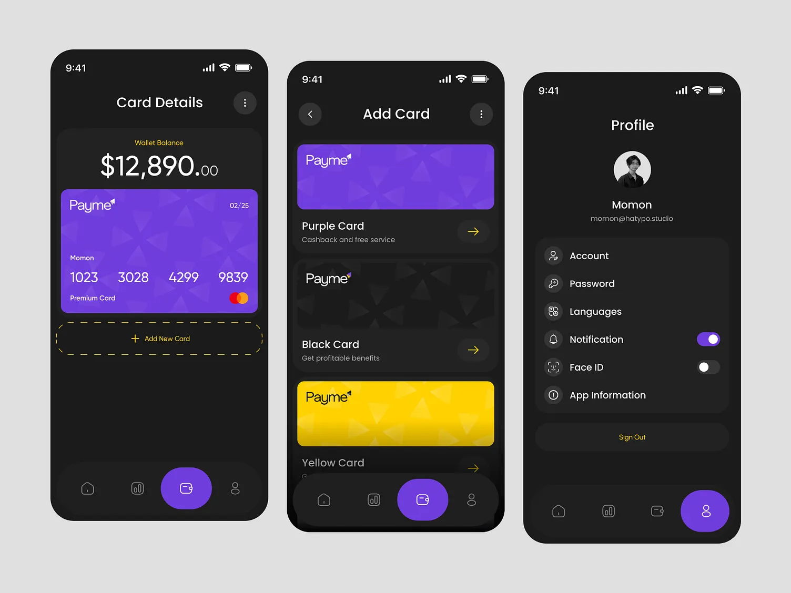

# Payme 👋

This is a React Native app designed based on [PayMe](https://dribbble.com/shots/20774179-Payme-Finance-Mobile-App-Detail-Screen) UI on [Dribbble](https://dribbble.com)

## Get started

1. Install dependencies

   ```bash
   npm install
   ```

2. Start the app

   ```bash
   npx expo start
   ```

In the output, you'll find options to open the app in a

- [development build](https://docs.expo.dev/develop/development-builds/introduction/)
- [Android emulator](https://docs.expo.dev/workflow/android-studio-emulator/)
- [iOS simulator](https://docs.expo.dev/workflow/ios-simulator/)
- [Expo Go](https://expo.dev/go), a limited sandbox for trying out app development with Expo

## [UI](https://dribbble.com/shots/20774179-Payme-Finance-Mobile-App-Detail-Screen)






